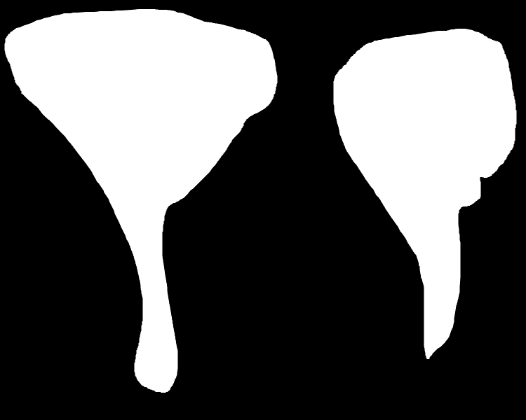

# 🎨 AI Art Restorer

Restore damaged or aged artwork using AI-powered image enhancement, inpainting, and style-preserving reconstruction. This project leverages the **LaMa (Resolution-robust Large Mask Inpainting)** model to provide high-quality restorations.

## 🌟 Features

- **Interactive Web Interface**: Easy-to-use UI for uploading images and drawing masks.
- **AI-Powered Restoration**: State-of-the-art inpainting using LaMa.
- **Cloud & Local Support**: Can be run locally or deployed as a cloud service (GCP/Vertex AI).
- **Dataset Generation**: Tools for creating synthetic "damaged" artwork for training.

## 📸 Examples

| Original / Damaged | Mask | Restored |
| :---: | :---: | :---: |
|  |  | *Restoration in progress...* |

## 📁 Project Structure

- `main.py`: FastAPI web application (Frontend/API Gateway).
- `app.py`: LaMa Inpainting API (Backend logic).
- `scripts/`: Utility scripts for cloud deployment and data management.
  - `dataset_generation/`: Scripts to create damaged images for training.
  - `data_transfer/`: Scripts for moving data between local and GCS.
- `lama/`: Core LaMa model implementation.
- `templates/`: HTML templates for the web interface.
- `examples/`: Sample images for testing.

## 🛠️ Prerequisites

- Python 3.13 or higher
- [uv](https://github.com/astral-sh/uv) package manager (recommended) or pip

## 🚀 Installation

1. **Clone the repository**:
   ```bash
   git clone https://github.com/yourusername/artrestorer.git
   cd artrestorer
   ```

2. **Install dependencies**:
   Using `uv`:
   ```bash
   uv sync
   ```
   Using `pip`:
   ```bash
   pip install -e .
   ```

3. **Setup LaMa**:
   Run the setup script to download models and prepare the environment:
   ```bash
   bash scripts/setup_lama.sh
   ```

## 💻 Running the Application

### Local Web Interface
Start the FastAPI server:
```bash
python main.py
```
The application will be available at [http://localhost:8000](http://localhost:8000).

### Inpainting API
If you want to run the backend API separately:
```bash
python app.py
```

## ☁️ Cloud Deployment

The project includes scripts for deploying to Google Cloud Run and Vertex AI. See `scripts/upload.py` for deployment configuration.

## 📄 License

This project is licensed under the MIT License - see the [LICENSE](LICENSE) file for details. (Note: LaMa model has its own license in the `lama/` directory).
